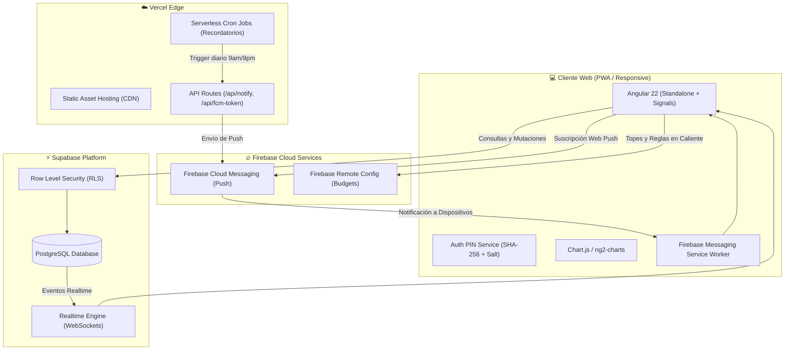
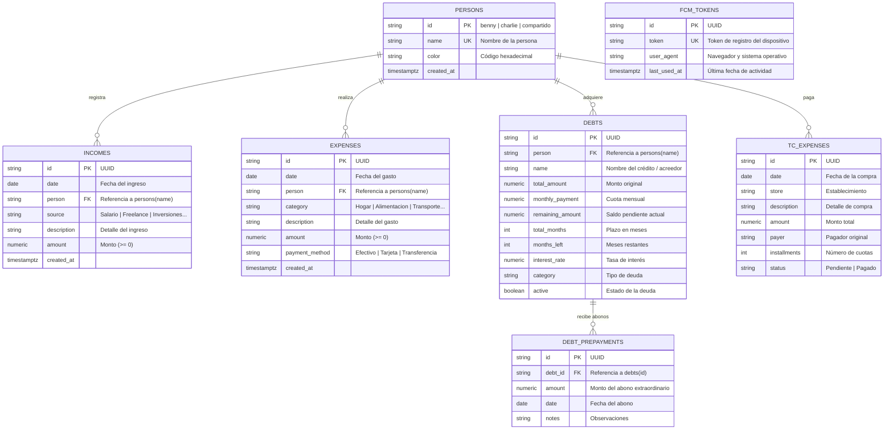
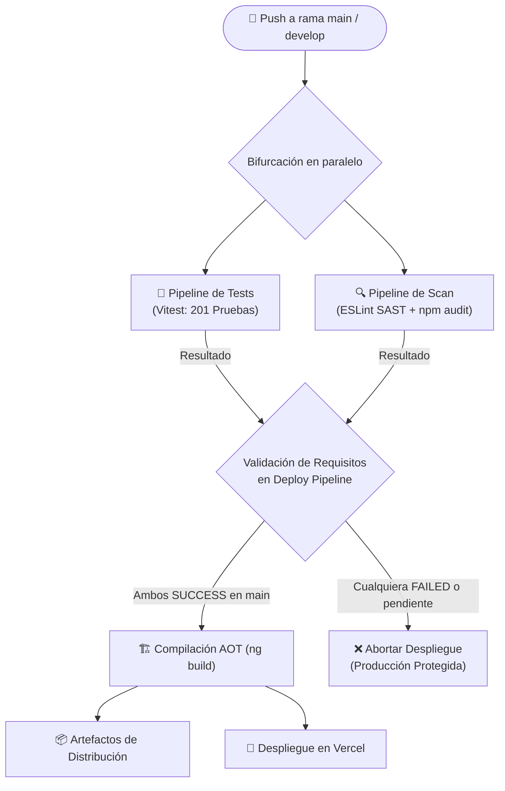

# 🏠 Finanzas Hogar · Control Familiar

> Aplicación web colaborativa y de alta precisión para la gestión financiera integral, control de gastos compartidos, presupuestos familiares, deudas y liquidación de tarjetas de crédito. Construida con una arquitectura reactiva basada en **Angular 22**, base de datos relacional en tiempo real con **Supabase (PostgreSQL)**, servicios cloud de **Firebase** y despliegue continuo en **Vercel**.

---

## 📑 Tabla de Contenidos

- [Visión General](#-visión-general)
- [Módulos y Funcionalidades](#-módulos-y-funcionalidades)
- [Arquitectura del Sistema](#-arquitectura-del-sistema)
- [Stack Tecnológico](#-stack-tecnológico)
- [Modelo de Base de Datos (Supabase)](#-modelo-de-base-de-datos-supabase)
- [Configuración Dinámica (Firebase Remote Config)](#-configuración-dinámica-firebase-remote-config)
- [Notificaciones Push y Recordatorios](#-notificaciones-push-y-recordatorios)
- [Seguridad y Control de Acceso (PIN Lock)](#-seguridad-y-control-de-acceso-pin-lock)
- [Flujo de CI/CD y Calidad de Software](#-flujo-de-cicd-y-calidad-de-software)
- [Guía de Desarrollo y Puesta en Marcha](#-guía-de-desarrollo-y-puesta-en-marcha)
- [Scripts Disponibles](#-scripts-disponibles)
- [Estructura del Proyecto](#-estructura-del-proyecto)

---

## 🎯 Visión General

**Finanzas Hogar** resuelve la complejidad de administrar las finanzas compartidas y personales en el hogar (Benny y Charlie). A diferencia de las hojas de cálculo tradicionales o apps genéricas, esta plataforma ofrece:

- **Transparencia total**: Visibilidad clara de quién gasta, quién aporta y cuánto le corresponde pagar a cada uno.
- **Topes dinámicos e inmutables**: Presupuestos por categoría controlados centralizadamente sin necesidad de desplegar nuevo código.
- **Liquidación justa de deudas y tarjetas**: Control de compras en cuotas, cálculo de saldos restantes y amortización FIFO de deudas.
- **Privacidad familiar**: Bloqueo criptográfico con PIN de 4 dígitos y protección anti-fuerza bruta.
- **Automatización**: Recordatorios diarios por Web Push para mantener las cuentas al día.

---

## 🚀 Módulos y Funcionalidades

### 1. 📊 Resumen Mensual y Dashboard Financiero
- **Balance General**: Consolidación en tiempo real de Ingresos vs. Gastos Diarios vs. Ahorro / Inversión.
- **Métricas Clave (KPIs)**: Tasa de ahorro mensual, balance neto y distribución porcentual del esfuerzo financiero por persona.
- **Gráficos Interactivos**:
  - Comparativa de barras mes a mes (Ingresos vs. Gastos).
  - Evolución patrimonial y tendencia histórica de ahorro acumulado.

### 2. 💵 Gestión de Ingresos
- Registro de fuentes de ingreso por persona (Salario, Freelance, Arriendos, Inversiones, Bonos, etc.).
- Filtro interactivo por mes (por defecto mes en curso, con selector de histórico anual).
- Algoritmo de cálculo de aportes proporcionales según el nivel de ingresos de cada integrante frente al presupuesto común del hogar.

### 3. 🛒 Control de Gastos Diarios
- Registro detallado de gastos: fecha, categoría, pagador (Benny, Charlie, Compartido), descripción, método de pago y monto.
- **Filtros Dinámicos**: Por año, mes, día específico y persona.
- **Analítica Visual**:
  - Gráfico de barras apiladas día a día del mes seleccionado.
  - Gráfico de dona con distribución de gastos por rubro y cálculo de porcentajes.
- Tabla transaccional completa con búsqueda instantánea, edición y eliminación.

### 4. 🏷️ Presupuesto por Categoría
- Control estricto de límites de gasto en rubros como Hogar, Supermercado/Alimentación, Restaurantes, Servicios, Transporte, etc.
- **Topes Centralizados**: Conectados a Firebase Remote Config para garantizar inmutabilidad local (indicador visual de candado 🔒).
- **Semáforo de Cumplimiento**: Barras de progreso con código de color dinámico:
  - 🟢 **Verde**: Consumo inferior al 75% del presupuesto.
  - 🟡 **Amarillo**: Consumo entre el 75% y 99%.
  - 🔴 **Rojo**: Presupuesto excedido (>= 100%).

### 5. 💳 Tarjetas de Crédito Compartidas (TC)
- Registro y control de compras compartidas financiadas a 1 o múltiples cuotas.
- Cálculo de amortización mensual y distribución exacta del valor que debe pagar cada persona en el corte.
- **Tope Semanal Remoto**: Control del gasto semanal máximo para evitar sobregiros (`tc_weekly_budget`).
- Historial de estados de compras (Pendiente, Pagado, En cuotas).

### 6. 📉 Control de Deudas y Prepagos
- Registro y seguimiento de pasivos, préstamos personales y créditos familiares.
- Monitoreo de cuota mensual, saldo remanente, plazo total y meses restantes.
- **Módulo de Abonos Extraordinarios (Prepagos a Capital)**: Permite registrar pagos adicionales recalculando automáticamente el saldo pendiente y acelerando la liquidación del crédito.

---

## 🏛️ Arquitectura del Sistema



---

## 🛠️ Stack Tecnológico

| Capa | Tecnología | Propósito |
| :--- | :--- | :--- |
| **Framework Web** | Angular 22 (Next-Gen) | Componentes Standalone, Reactividad nativa con Signals, Control Flow moderno (`@if`, `@for`). |
| **Lenguaje** | TypeScript ~6.0 | Tipado estático estricto en modelos, servicios y utilidades. |
| **Visualización** | Chart.js 4 & ng2-charts 10 | Gráficos de barras apiladas, líneas de tendencia y donas de distribución. |
| **Base de Datos** | Supabase (PostgreSQL 15+) | Almacenamiento relacional, constraints de integridad, RLS y sincronización Realtime. |
| **Servicios Cloud** | Firebase SDK 12 | Remote Config (parámetros y topes) + FCM (Web Push Notifications). |
| **Infraestructura** | Vercel | Hosting estático global en Edge CDN, Serverless Functions y Cron Jobs. |
| **Testing** | Vitest 4 + Angular Testing | Suite de pruebas unitarias ultrarrápida (201 pruebas automatizadas). |
| **Calidad y SAST** | ESLint 10 + `@angular-eslint` + `eslint-plugin-security` | Análisis estático, buenas prácticas y prevención de vulnerabilidades (ReDoS, inyección). |
| **Auditoría** | Native npm audit | Auditoría continua de seguridad en dependencias. |

---

## 🗄️ Modelo de Base de Datos (Supabase)

La base de datos relacional PostgreSQL está estructurada en esquemas limpios y protegida con **Row Level Security (RLS)**:



---

## 🎛️ Configuración Dinámica (Firebase Remote Config)

El proyecto utiliza **Firebase Remote Config** como fuente centralizada de parámetros que pueden ajustarse desde la consola de Firebase sin necesidad de recompilar ni desplegar:

| Parámetro | Tipo | Descripción | Valor por Defecto |
| :--- | :---: | :--- | :--- |
| `tc_weekly_budget` | Número | Límite máximo de gasto semanal para la Tarjeta Compartida | `$ 100.000 COP` |
| `daily_reminder_morning_hour` | Número | Hora militar para el recordatorio matutino de registro | `9` (9:00 AM) |
| `daily_reminder_evening_hour` | Número | Hora militar para el recordatorio nocturno de registro | `21` (9:00 PM) |
| `daily_reminder_morning_message` | Texto | Mensaje motivacional del recordatorio matutino | *"☀️ ¡Buenos días! No olvides reportar..."* |
| `daily_reminder_evening_message` | Texto | Mensaje del recordatorio de cierre de jornada | *"🌙 ¡Buenas noches! Recuerda registrar..."* |
| `budget_hogar` | Número | Tope presupuestal mensual para el rubro Hogar | `$ 2.500.000 COP` |
| `budget_alimentacion` | Número | Tope presupuestal para Supermercado y Despensa | `$ 2.000.000 COP` |
| `budget_restaurantes` | Número | Tope presupuestal para Salidas y Restaurantes | `$ 1.000.000 COP` |
| `budget_transporte` | Número | Tope presupuestal mensual de Transporte | `$ 500.000 COP` |

---

## 🔔 Notificaciones Push y Recordatorios

El sistema mantiene a los usuarios al día mediante dos capas de recordatorios:

1. **Notificaciones Web Push (FCM)**:
   - Registro de dispositivos compatibles en la tabla `fcm_tokens` de Supabase.
   - Envío programado mediante Serverless Functions (`api/cron-reminder.js` y `api/notify.js`).
   - Recepción en segundo plano mediante Service Worker dedicado (`public/firebase-messaging-sw.js`).
2. **Banner In-App Inteligente**:
   - Componente visual reactivo (`daily-reminder-banner`) que evalúa si el usuario activo ya registró sus transacciones del día; si no lo ha hecho, presenta un acceso rápido para registrar gastos.

---

## 🔒 Seguridad y Control de Acceso (PIN Lock)

Para proteger la información financiera de miradas no autorizadas al compartir dispositivos familiares:

- **Criptografía Nativa**: El PIN de 4 dígitos nunca se almacena en texto plano. Se procesa usando la **Web Crypto API** (`crypto.subtle.digest`) con algoritmo **SHA-256** y adición de *Salt* criptográfico único.
- **Protección Anti-Fuerza Bruta**: Si se introducen **5 intentos fallidos consecutivos**, el sistema impone un bloqueo temporal de seguridad de **30 segundos** antes de permitir un nuevo intento.
- **Persistencia Segura**: Opción para recordar el dispositivo de confianza durante 30 días mediante un token de sesión hasheado.
- **Gestión de Credenciales**: Capacidad para actualizar el PIN familiar en cualquier momento desde la barra lateral.

---

## 🔄 Flujo de CI/CD y Calidad de Software

El proyecto cuenta con una arquitectura de integración continua y despliegue **100% desacoplada en tres pipelines independientes**, garantizando que **ningún despliegue a producción ocurra sin haber aprobado con éxito tanto las pruebas como el análisis estático de código**:



### Pipelines en GitHub Actions (`.github/workflows/`):
1. **`🧪 Tests Pipeline` (`tests.yml`)**: Ejecuta `npm run test:ci` validando todas las reglas de negocio en Vitest.
2. **`🔍 Scan Pipeline` (`scan.yml`)**:
   - `Static Code Analysis & SAST`: Ejecuta `npm run lint` aplicando `@angular-eslint` y `eslint-plugin-security` para detectar patrones vulnerables (ej. ReDoS, object injection).
   - `Dependency Vulnerability Audit`: Ejecuta `npm run audit` para auditar la cadena de dependencias.
3. **`🚀 Deploy Pipeline` (`deploy.yml`)**: Se dispara tras la finalización de los pipelines previos, comprueba el estado del commit mediante la API de GitHub Actions y autoriza la compilación y despliegue a producción únicamente cuando ambos son exitosos.

*(Misma arquitectura disponible en GitLab CI mediante `.gitlab-ci.yml`, `tests.gitlab-ci.yml`, `scan.gitlab-ci.yml` y `deploy.gitlab-ci.yml`).*

---

## 💻 Guía de Desarrollo y Puesta en Marcha

### Requisitos Previos
- **Node.js**: Versión `>= 20.x` (Recomendado Node 22).
- **npm**: Versión `>= 10.x`.
- Cuenta en **Supabase** y proyecto activo con el esquema SQL ejecutado.
- Proyecto en **Firebase** con credenciales web y Remote Config configurado.

### Instalación Paso a Paso

1. **Clonar el repositorio**:
   ```bash
   git clone https://github.com/wearebdycr-svg/expenses-home.git
   cd expenses-home
   ```

2. **Instalar dependencias**:
   ```bash
   npm install
   ```

3. **Configurar variables de entorno**:
   Crea el archivo `.env` en la raíz del proyecto tomando como base `.env.example`:
   ```bash
   cp .env.example .env
   ```

   Diligencia las variables requeridas:
   ```env
   # Supabase Configuration
   SUPABASE_URL=https://tu-proyecto.supabase.co
   SUPABASE_ANON_KEY=tu-anon-key-publica

   # Firebase Configuration
   FIREBASE_API_KEY=tu-api-key
   FIREBASE_AUTH_DOMAIN=tu-proyecto.firebaseapp.com
   FIREBASE_PROJECT_ID=tu-proyecto-id
   FIREBASE_STORAGE_BUCKET=tu-proyecto.firebasestorage.app
   FIREBASE_MESSAGING_SENDER_ID=tu-sender-id
   FIREBASE_APP_ID=tu-app-id
   FIREBASE_MEASUREMENT_ID=tu-measurement-id
   FIREBASE_VAPID_KEY=tu-vapid-key-publica
   ```

4. **Generar los entornos de Angular**:
   ```bash
   npm run config:env
   ```
   *(Este paso se ejecuta automáticamente al correr `npm start`, `npm run build` o `npm test`).*

5. **Iniciar el servidor de desarrollo**:
   ```bash
   npm start
   ```
   Abre [http://localhost:4200/](http://localhost:4200/) en tu navegador. El PIN inicial por defecto es `2026`.

---

## 📜 Scripts Disponibles

| Comando | Descripción |
| :--- | :--- |
| `npm start` | Inicia el servidor de desarrollo local con recarga en caliente (`ng serve`). |
| `npm run build` | Compila la aplicación optimizada para producción con AOT (`dist/`). |
| `npm test` | Ejecuta la suite de pruebas unitarias con Vitest en modo interactivo. |
| `npm run test:ci` | Ejecuta las pruebas unitarias una sola vez para entornos de CI/CD. |
| `npm run lint` | Ejecuta el análisis estático con ESLint, Angular ESLint y reglas SAST. |
| `npm run lint:fix` | Corrige de forma automática problemas de estilo y formato en el código. |
| `npm run audit` | Audita vulnerabilidades conocidas de seguridad en dependencias de npm. |
| `npm run config:env` | Genera los archivos de `src/environments/` a partir de `.env` o variables CI/CD. |

---

## 📂 Estructura del Proyecto

```text
expenses-home/
├── .github/workflows/          # Pipelines de CI/CD para GitHub Actions
│   ├── tests.yml               # Pipeline de Pruebas Unitarias
│   ├── scan.yml                # Pipeline de Escaneo Estático y Auditoría (SAST)
│   └── deploy.yml              # Pipeline de Compilación y Despliegue Condicional
├── .gitlab/ci/                 # Pipelines equivalentes para GitLab CI
│   ├── tests.gitlab-ci.yml
│   ├── scan.gitlab-ci.yml
│   └── deploy.gitlab-ci.yml
├── api/                        # Funciones Serverless de Vercel
│   ├── cron-reminder.js        # Disparador programado de recordatorios
│   ├── fcm-token.js            # Registro y actualización de tokens Push
│   └── notify.js               # Envío de notificaciones FCM vía Firebase Admin
├── public/                     # Recursos públicos estáticos y Service Worker FCM
├── scripts/                    # Scripts de soporte para la compilación
│   └── set-env.js              # Generador dinámico de environments
├── src/
│   ├── app/
│   │   ├── core/               # Servicios transversales singleton
│   │   │   └── services/       # Supabase, FCM, Remote Config, Auth PIN, Toast...
│   │   ├── features/           # Módulos de funcionalidad de negocio
│   │   │   ├── resumen/        # Dashboard global, balances y gráficas históricas
│   │   │   ├── ingresos/       # Registro y proporcionalidad de ingresos
│   │   │   ├── gastos/         # Gastos diarios, filtros y KPIs
│   │   │   ├── categoria/      # Presupuestos por rubro y semáforo de alerta
│   │   │   ├── tc-compartida/  # Gestión de tarjetas compartidas y cuotas
│   │   │   └── deudas/         # Pasivos, créditos y abonos a capital (prepagos)
│   │   └── shared/             # Componentes de UI reutilizables y utilidades
│   │       ├── ui/             # Sidebar, Modal, PinLock, Toast, Badges...
│   │       └── utils/          # Formateadores monetarios (Intl), fechas, etc.
│   └── environments/           # Archivos de entorno generados dinámicamente
├── supabase/                   # Scripts de migración SQL, esquemas y políticas RLS
├── angular.json                # Configuración del workspace Angular CLI
├── eslint.config.mjs           # Flat config de ESLint + Angular + Security SAST
├── remote_config.json          # Definición y defaults de Firebase Remote Config
├── vercel.json                 # Configuración de headers, CSP y rutas en Vercel
└── package.json                # Dependencias, scripts y metadatos del proyecto
```

---

## 👥 Equipo y Autores

- **Desarrollado para**: Control financiero del hogar de **Benny** y **Charlie**.
- **Licencia**: Privada / Uso familiar.
